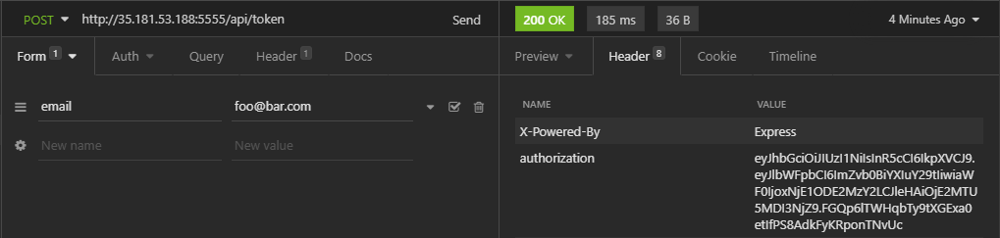
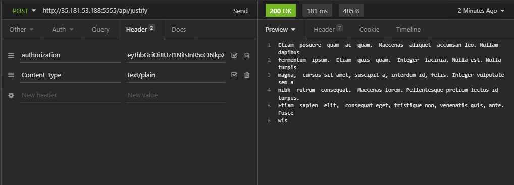
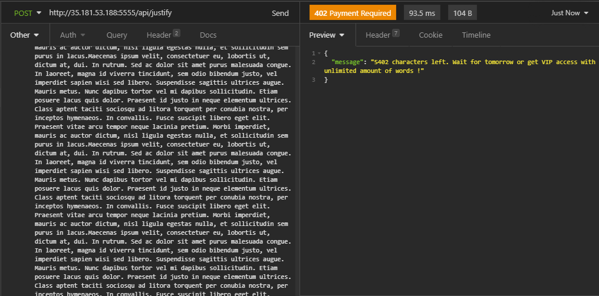

# Une application qui justifie votre texte !

:warning: **Cette application n'est pas disponible avec une interface graphique, seul le traitement back est fonctionnel. Pour tester l'application, il vous faudra posséder un utilitaire de type [Postman](https://www.postman.com/downloads/ "Télécharger Postman") ou [Insomnia](https://insomnia.rest/download "Télécharger Insomnia")**

## Technologies de l'application

Cette application est réalisé avec les technologies suivantes :
* NodeJS,
* MongoDB,
* Express

## MVP

Catte application vous permmettra :
* D'authentifier un utilisateur via son adresse email,
* De créer un token avec une durée de vie de 24h
* De justifier un texte pouvant aller jusqu'à 80000 mots toutes les 24h pour la partie gratuite de l'application

## Démarrage de l'application

Afin de pouvoir faire tourner cette application, il faut au préalable installer et configurer si nécessaire les outils suivants : 

* NodeJS et le manager de pacquet npm
* MongoDB

:warning: **Il faudra aussi prévoir un fichier ".env" avec vos informations de connexion à votre base de donnée mongo, un fichier exemple est disponible dans ce dossier.**

## Côté back (Installation en local)

Cloner ce repo : 

```shell
git clone https://github.com/KevinBrb/justifapp.git
```

A la racine du dossier : 

```shell
npm install
```

Installer nodemon : 

```shell
npm install nodemon
```

Pour démarrer le server :

```shell
npm start
```

## Import d'un jeu de données

Si vous souhaitez importer des données de tests : 

```shell
node ./data/import.js
```

:warning: **Attention à bien modifier le .env ainsi que la ligne 3 du fichier app/models/User.js pour le nom de la collection**

## Utilisation

Afin d'utiliser au mieux cette application, il vous faudra effectuer les étapes suivantes : 
* Envoyer un formulaire contenant un champ email avec la valeur d'un email utilisateur déjà présent en base de données. Cela vous permettra de récupérer le token dans le header (authorization) de la réponse du endoint '/api/token' (voir image)



* Justifier un texte (Content-Type text/plain) si vous envoyez votre requête avec un token valide dans le header => '/api/justify'



* Renvoyer une erreur si le rate limit de mot est dépassé



L'application est déployée sur l'ip 35.181.53.188:5555 et peut-être utilisée avec Postman ou Insomnia.

Documentation disponible [ici](http://35.181.53.188:5555/api-docs "Documentation API") ou http://localhost:5555/api-docs si vous êtes en local.

## Quelques tests

J'ai mis en place quelques tests unitaires pour la forme (disponible dans le dossier tests à la racine) ! Pour les lancer, exécuter cette commande :

```shell
npm run test
```